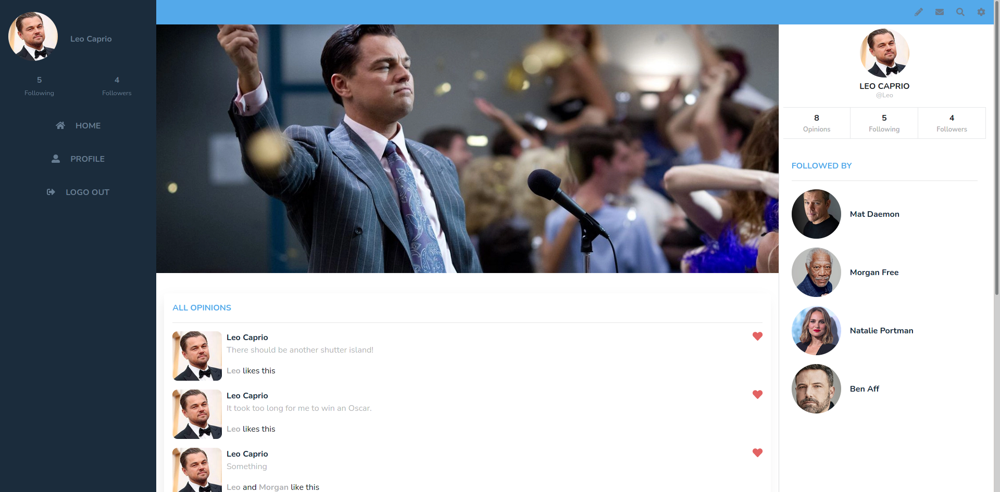
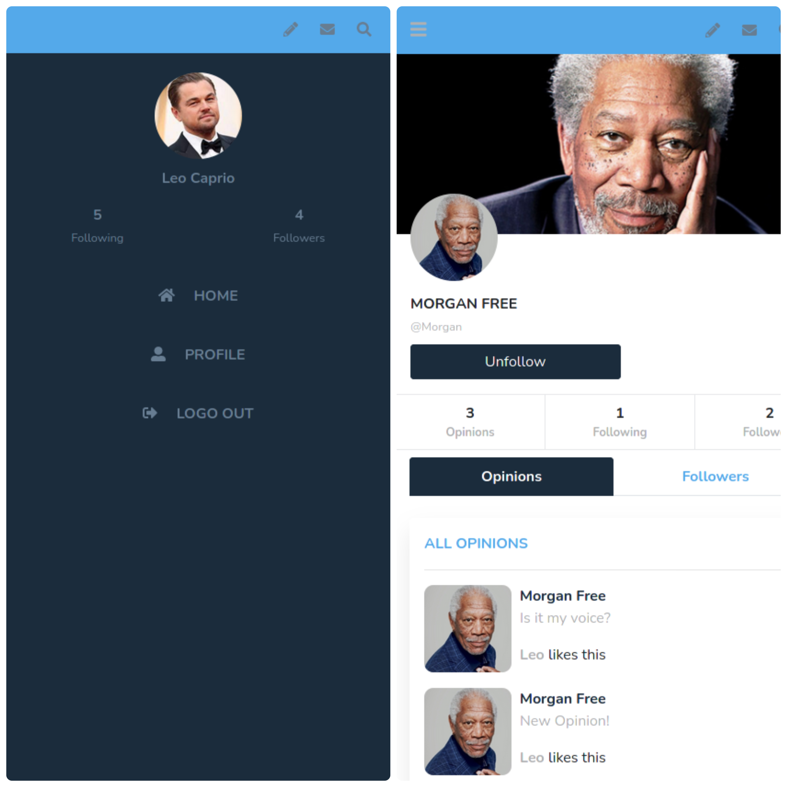
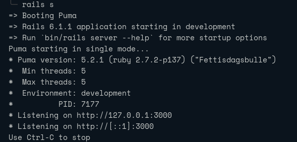

<h1 align="center">
  <br>
  <a href="https://github.com/smcommits/moviecop/archive/develop.zip"></a>
</h1>

<h1 align="center">Moviecop</h1>

<p align="center">
  <a href="#about">About</a> •
  <a href="#prerequisites">Prerequisites</a> •
  <a href="#available-features">Available Features</a> •
  <a href="#getting-started">Getting Started</a> •
  <a href="#contributing">Contributing</a> •
  <a href="#authors">Authors</a> •
  <a href="#license">License</a>
</p>

---

## About
Moviecop is an opinion sharing platform about Movies. The application is written in Ruby by using Ruby on Rails web framework.

## Live Demo
[Click here](https://moviecop.herokuapp.com) to visit the live demo of the application. 

Note: The application is hosted on the free tier of Heroku and therefore the images attached will not persist after the next dyno reset. In simple words, the images that a user will upload to the live demo will disappear in 24 hours. 

## Screens
#### Desktop

### Mobile

## Available Features

Moviecop comes with a very basic functionality of a social networking platform:
- A user can follow other users
- Users can upload photographs and share opinions
- The users can like the opinions of other users. 

Although functionalities are limited at the moment, the application is desinged in a manner that it is scalable and any new feature can be implemented with ease. 

## Usage

### Prerequisites

Prior to running the application locally the user will have to make sure of the following:
- Installing  Ruby
- Installing Ruby on Rails

You also need to make sure that yarn is up to date
- yarn isntall --check-files


### Getting Started

#### Step 1

To get started you have to clone the repo on your local machine. To clone the repo run the following command in a terminal emulator:
   
```
git clone https://github.com/smcommits/moviecop
```
       
Alternatively, you can click [this link](https://github.com/smcommits/moviecop/archive/develop.zip) to download the repo as a zip file.

#### Step 2

Navigate to the moviecop folder
```
cd moviecop
```

#### Step 3

Install all the dependencies by running the following command
```
bundle install
```

#### Step 4
Perform the database migration by using the following command

```
rails db:migrate
```

### Step 5
Fire up the rails server using the following command
```
rails s
```

The output will look similar to the following screenshot 


Visit the url localost:xxxx in your output to run the application in your browser

## Authors

👤 **Anas Siddiqui**
  - GitHub: [@githubhandle](https://github.com/smcommits)
  - LinkedIn: [linkedIn](https://linkedin.com/in/sm-anas)


## 🤝Contributing

Contributions, issues, and feature requests are welcome!

## Show your support

Give a ⭐️ if you like this project!

## Acknowledgments

### Rails Guides
  [Rails Guides](https://guides.rubyonrails.org/) is on of the best resources that will help you understand the concpets necessary to work with a Rails application
  
### Movie Logo
   <div>Icons made by <a href="https://www.freepik.com" title="Freepik">Freepik</a> from <a href="https://www.flaticon.com/" title="Flaticon">www.flaticon.com</a></div>
   
## License

This project is [MIT](./LICENSE) licensed.


